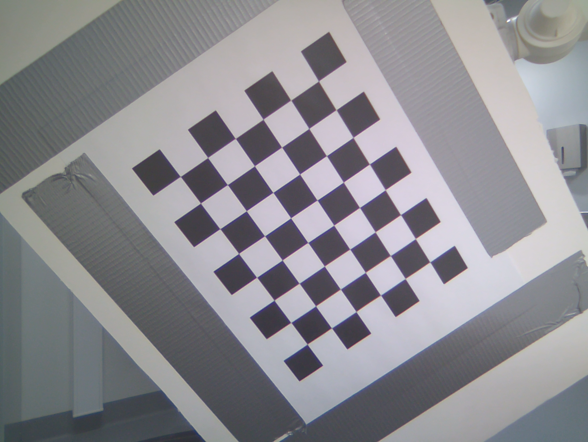
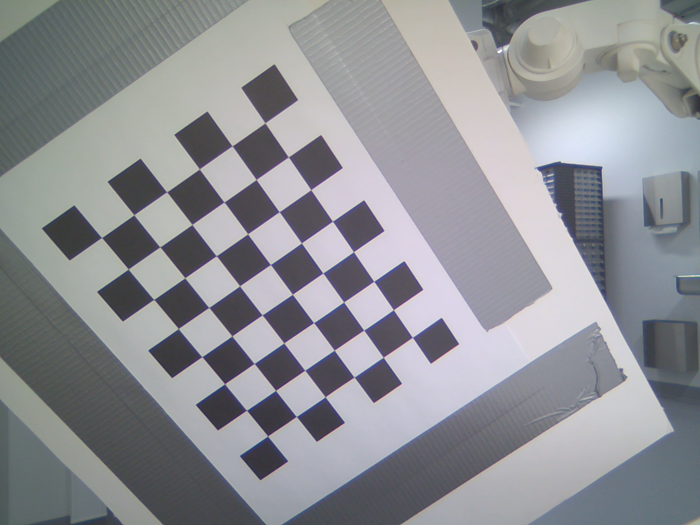
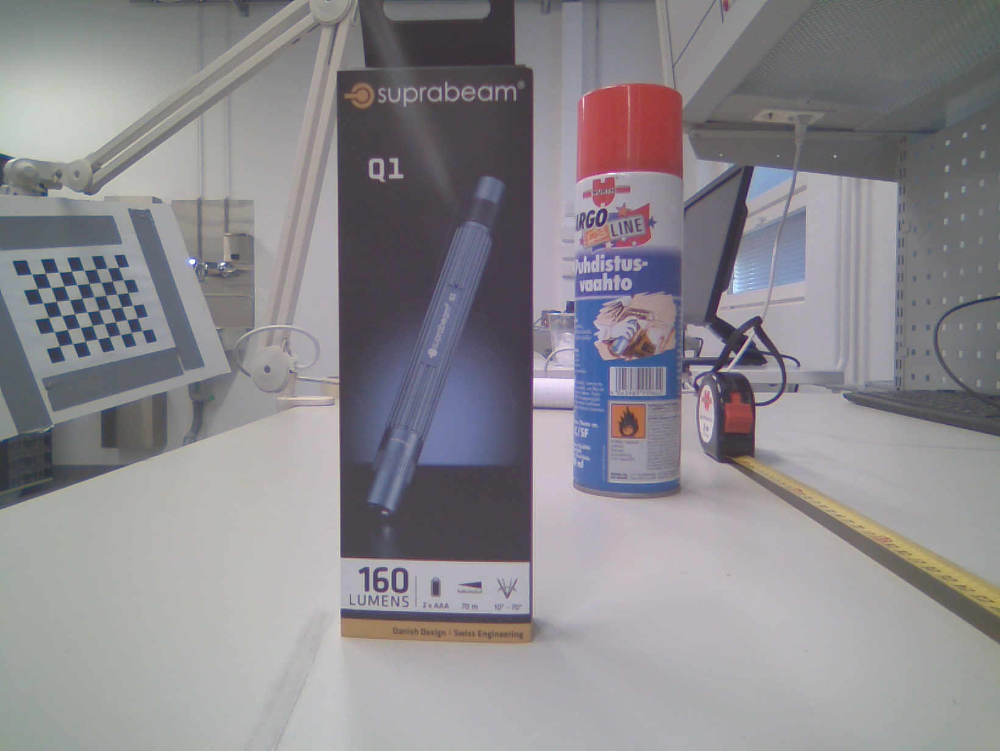
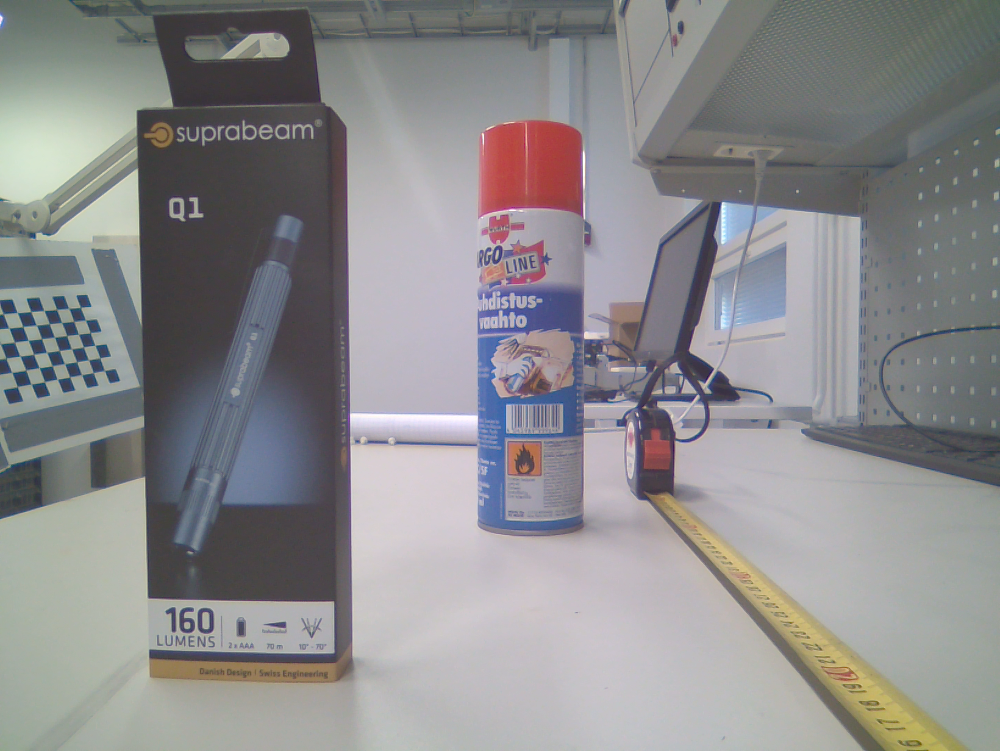
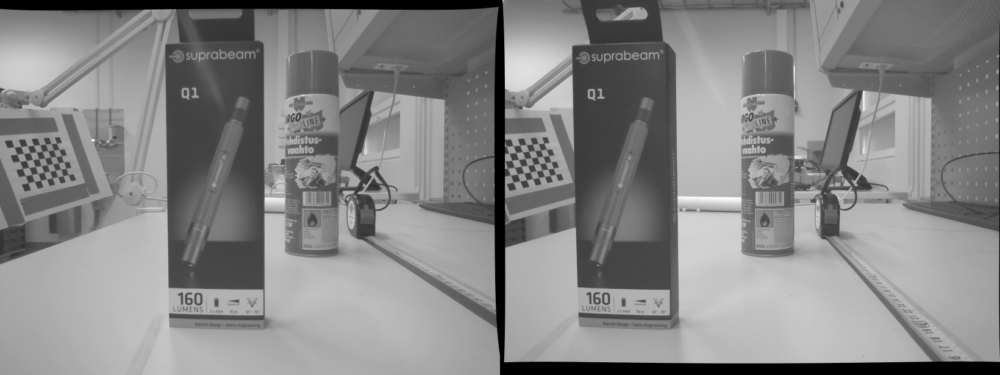
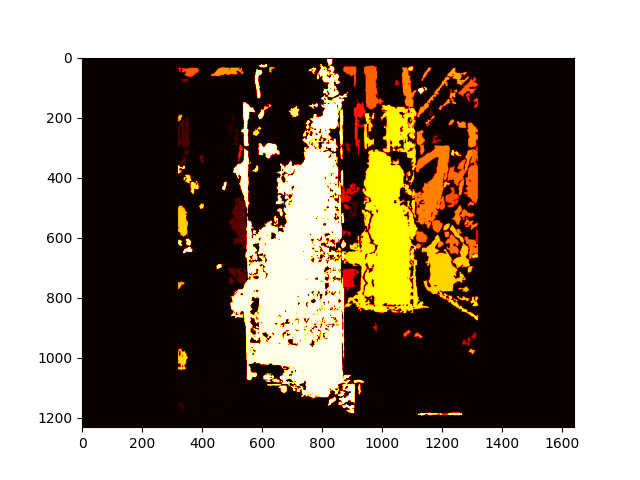

# Stereo vision with Jetson Nano and IMX219 stereo module
## Setup
```
pip3 install -r requirements.txt
```
## Usage
### Calibration data
Capture calibration data with a Jetson Nano and IMX219 module (or other CSI-camera stereo module)
```
python3 camera_record.py
```
Press 'c' to capture frames, press 'q' to quit.

<p float="left">
  
   
</p>

### Calibration
Place calibration data in separate, camera-specific folders.
Measure the physical size of squares (in m), and check the size of the board (as in number of square corners, width x height).
Only inner square corners count (as in, corners that have squares on each side).
```
python3 calibration.py -l <path/to/left/images/> -r <path/to/right/images/> -s <path/to/parameter/save/directory/> -sq <square size, in m> -bd <board size, width x height>
```
### Extract depth
With saved camera parameters, extract depth information from test image pair
```
python3 depth.py -p <path/to/parameter/directory/> -l <path/to/left/image> -r <path/to/right/image>
```
<p float="left">
  
   
</p>
<p float="left">
  
</p>
<p float="left">
  
</p>


